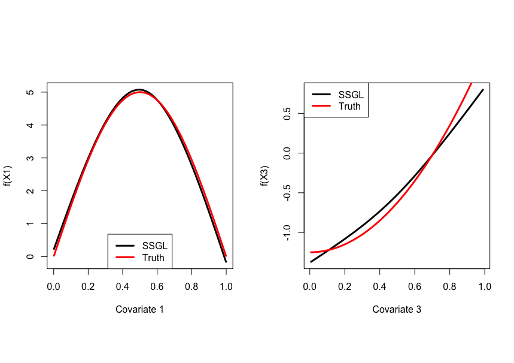
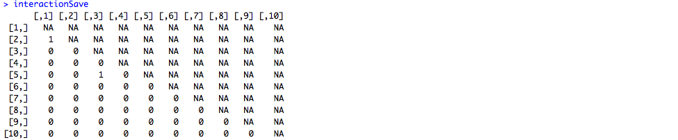

# SSGL
R package implementing the spike and slab group lasso

This is an R package to implement methods seen in "Spike-and-Slab Group Lassos for Grouped Regression and Sparse Generalized Additive Models" by Ray Bai, Gemma Moran, Joseph Antonelli, Yong Chen and Mary Boland, which can be found at the following link:

https://arxiv.org/pdf/1903.01979.pdf

To download the R package use the following in R:

```
library(devtools)
install_github(repo = "jantonelli111/SSGL")
library(SSGL)
```

There are four main functions in the package, which we will show how to use below. These functions and their corresponding purposes are as follows:

SSGL - The standard function for using the spike and slab group lasso . 
SSGLcv - The function used to find the value of lambda0 to use
SSGLspr - A function to use spike and slab group lasso for semiparametric regression using sparse additive linear models

# How to use the software

Here, we will simulate a simple example to show how the software works. First we will show how the function works for a chosen value of lambda0

```{r, eval=FALSE}
n = 200
G = 100
x = mvtnorm::rmvnorm(n, sigma=diag(G))


X = matrix(NA, nrow=n, ncol=G*2)

for (g in 1 : G) {
  X[,2*(g-1) + 1] = x[,g]
  X[,2*g] = x[,g]^2
}

Y = 200 + x[,1] + x[,2] + 0.6*x[,2]^2 + rnorm(n, sd=1)

## Now fit model for chosen lambda0 and lambda1 values
modSSGL = SSGL(Y=Y, X=X, lambda1=.1, lambda0=10, 
groups = rep(1:G, each=2))

```

This will contain a list with estimates of the intercept, regression coefficients, residual variance, global sparsity parameter (theta), and the number of iterations it took to converge. Let's look at a couple of these now.

```{r, eval=FALSE}
## The first twenty regression coefficients
modSSGL$beta[1:20]
```


```{r, eval=FALSE}
## Estimate of the residual variance
modSSGL$sigmasq
```


```{r, eval=FALSE}
## Estimate of theta
modSSGL$theta
```


So we see that our model has correctly identified the first two covariates (represented in this example by first 4 covariates) as nonzero, while zeroing out the remaining coefficients. This example relied on a well-chosen value of lambda0, which we won't know in general. To solve this, one can use the cross-validation function as below:


```{r, eval=FALSE}
modSSGLcv = SSGLcv(Y=Y, X=X, lambda1=.1, lambda0seq = seq(4,20, by=2),
groups = rep(1:G, each=2), nFolds = 5)
```


Notice that you might see a warning message about the algorithm diverging. This tends to happen only for small lambda0 values, and is not a problem unless you see this warning for each lambda0 value in your sequence. In our experience, lambda0 sequences should go from around 1 to 25. Now one can check what the chosen value of lambda0 is:


And lastly run the model with the chosen lambda0 value:

```{r, eval=FALSE}
modSSGL = SSGL(Y=Y, X=X, lambda1=.1, lambda0=modSSGLcv$lambda0, 
               groups = rep(1:G, each=2))
```

# Use in sparse generalized additive models (GAMs)

Now we will show how the SSGL procedure can be used to model sparse additive generalized models. We will use roughly the same functions as seen in the manuscript of the paper. We will model the effect of each covariate using 2 degree of freedom splines. First, we simulate G covariates, and then we create new design matrices using natural splines.

```{r, eval=FALSE}
library(splines)

TrueF = function(x) {
  return(5*sin(pi*x[,1]) + 
           2.5*(x[,3]^2 - 0.5) + 1*exp(x[,4]) + 3*x[,5])
}

n = 200
G = 100

## Generating training data
x = matrix(runif(G*n), nrow=n)
Y = TrueF(x) + rnorm(n, sd=1)

## degrees of freedom of the splines
mg = 2

X = matrix(NA, nrow=n, ncol=G*mg)

## create design matrix with 2 degree of freedom splines
## ensuring that the variables within each group are orthogonal
for (g in 1 : G) {
  splineTemp = ns(x[,g], df=mg)
  X[,mg*(g-1) + 1] = splineTemp[,1]
  for (m in 2 : mg) {
    tempY = splineTemp[,m]
    tempX = X[,(mg*(g-1) + 1):(mg*(g-1) + m - 1)]
    modX = lm(tempY ~ tempX)
    X[,mg*(g-1) + m] = modX$residuals
  }
}
```

And now we can build our SSGL model, first using cross-validation to find the appropriate tuning parameter value.

```{r, eval=FALSE}
lambda0seq = seq(3, 25, by=2)

## Cross validation
modSSGLcv = SSGLcv(Y=Y, X=X, lambda1=.1, 
                   lambda0seq = lambda0seq,
                   groups = rep(1:G, each=mg),
                   nFolds = 25)

## Final model
modSSGL = SSGL(Y=Y, X=X, lambda1=.1, lambda0=modSSGLcv$lambda0, 
               groups = rep(1:G, each=mg))
```

And finally, we can plot the effect of exposure 1 and exposure 3 on the outcome. 

```{r, eval=FALSE}
par(mfrow=c(1,2), pty='s')
## Plot the effect of exposure 1 on the outcome
ord = order(x[,1])
Curve = X[ord,1:2] %*% modSSGL$beta[1:2]
Truth = 5*sin(pi*x[ord,1])
plot(x[ord,1], Curve + mean(Truth) - mean(Curve), type='l', lwd=3,
     xlab="Covariate 1", ylab="f(X1)")
lines(x[ord,1], Truth, col=2, lwd=3)
legend("bottom", c("SSGL", "Truth"), lwd=3, lty=1, col=1:2)

## Plot the effect of exposure 3 on the outcome
ord = order(x[,3])
Curve = X[ord,5:6] %*% modSSGL$beta[5:6]
Truth = 2.5*(x[ord,3]^2 - 0.5)
plot(x[ord,3], Curve + mean(Truth) - mean(Curve), type='l', lwd=3,
     xlab="Covariate 3", ylab="f(X3)")
lines(x[ord,3], Truth, col=2, lwd=3)
legend("topleft", c("SSGL", "Truth"), lwd=3, lty=1, col=1:2)
```



# Use in nonlinear interaction models

Here we will show how the SSGL procedure can be used to identify nonlinear interactions among a high-dimensional set of possible interactions. First we need to generate some data that includes interaction terms:

```{r, eval=FALSE}
TrueF = function(x) {
  return(2.5*(sin(pi*x[,1]*x[,2])) + 2*(cos(pi*(x[,3] + x[,5]))) +
           2*(x[,6] - 0.5) + 2.5*x[,7])
}

n = 300
G = 10

## generate data
x = matrix(runif(G*n), nrow=n)
Y = TrueF(x) + rnorm(n, sd=1)
```

And now we need to construct both main effect and interaction design matrices using nonlinear functions from natural splines. First we can start with the main effects:

```{r, eval=FALSE}
## Run our approach for 2 degrees of freedom

mg = 2

X = matrix(NA, nrow=n, ncol=(G*mg) + choose(G,2)*(mg^2))

## create main effect component of design matrix
for (g in 1 : G) {
  splineTemp = ns(x[,g], df=mg)
  X[,mg*(g-1) + 1] = splineTemp[,1]
  for (m in 2 : mg) {
    tempY = splineTemp[,m]
    tempX = X[,(mg*(g-1) + 1):(mg*(g-1) + m - 1)]
    modX = lm(tempY ~ tempX)
    X[,mg*(g-1) + m] = modX$residuals
  }
}
```
And now we can move to interaction terms. Note that we are constructing the interaction terms to be orthogonal to the main effect terms so that they only capture information that is orthogonal to the main effects. 

```{r, eval=FALSE}
## create interaction component of design matrix
## ensuring that interaction terms are independent
## of their corresponding main effects
counter = 1
for (g1 in 2 : G) {
  for (g2 in 1 : (g1 - 1)) {
    splineTemp1 = ns(x[,g1], df=mg)
    splineTemp2 = ns(x[,g2], df=mg)
    
    designX = matrix(NA, n, mg^2)
    counter2 = 1
    for (m1 in 1 : mg) {
      for (m2 in 1 : mg) {
        tempY = splineTemp1[,m1]*splineTemp2[,m2]
        tempMod = lm(tempY ~ splineTemp1 + splineTemp2)
        designX[,counter2] = tempMod$residuals
        counter2 = counter2 + 1
      }
    }
    
    X[,((G*mg) + (counter-1)*(mg^2) + 1) : ((G*mg) + counter*(mg^2))] = designX
    counter = counter + 1
  }
} 

groups = c(rep(1:G, each=mg), rep(G + 1:(choose(G,2)), each=mg^2))
```

Now we can run our model using cross validation to find lambda0.

```{r, eval=FALSE}
lambda0seq = seq(3, 25, by=2)

## Cross validation
modSSGLcv = SSGLcv(Y=Y, X=X, lambda1=.1, 
                   lambda0seq = lambda0seq,
                   groups = groups,
                   a = 1, b = G, nFolds = 10,
                   updateSigma = TRUE,
                   M = 10, error = 0.0001)

## Final model
modSSGL = SSGL(Y=Y, X=X, lambda1=.1, lambda0=modSSGLcv$lambda0, 
               groups = groups,
               a = 1, b = G,
               updateSigma = TRUE,
               M = 10, error = 0.0001)
```

And now we can look at which interaction terms are important

```{r, eval=FALSE}
## Find which interaction terms are important
interactionSave = matrix(NA, G, G)

counter = 1
for (g1 in 2 : G) {
  for (g2 in 1 : (g1 - 1)) {
    interactionSave[g1,g2] = 1*(modSSGL$beta[((G*mg) + (counter-1)*(mg^2) + 1)] != 0)
    counter = counter + 1
  }
}

interactionSave

```



We see that there is an interaction term between covariate 1 and 2, as well as between covariate 3 and 5.
