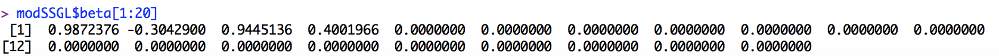
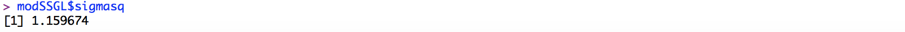
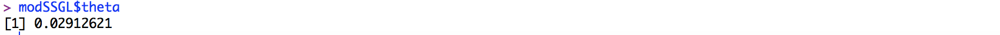
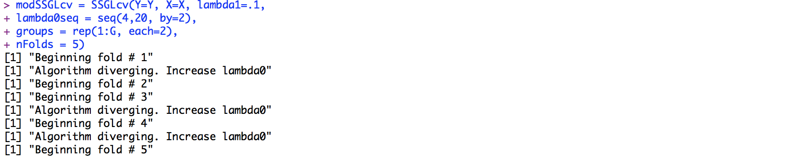
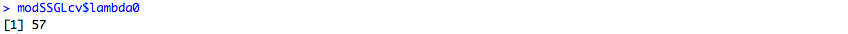

# SSGL
R package implementing the spike and slab group lasso

This is an R package to implement methods seen in "Spike-and-Slab Group Lassos for Grouped Regression and Sparse Generalized Additive Models" by Ray Bai, Gemma Moran, Joseph Antonelli, Yong Chen and Mary Boland, which can be found at the following link:

https://www.researchgate.net/publication/331463509_Spike-and-Slab_Group_Lassos_for_Grouped_Regression_and_Sparse_Generalized_Additive_Models

To download the R package use the following in R:

```
library(devtools)
install_github(repo = "jantonelli111/SSGL")
library(SSGL)
```

# How to use the software

Here, we will simulate a simple example to show how the software works. First we will show how the function works for a chosen value of lambda0

```{r, eval=FALSE}
n = 200
G = 100
x = mvtnorm::rmvnorm(n, sigma=diag(G))


X = matrix(NA, nrow=n, ncol=G*2)

for (g in 1 : G) {
  X[,2*(g-1) + 1] = x[,g]
  X[,2*g] = x[,g]^2
}

Y = 200 + x[,1] + x[,2] + 0.6*x[,2]^2 + rnorm(n, sd=1)

## Now fit model for chosen lambda0 and lambda1 values
modSSGL = SSGL(Y=Y, X=X, lambda1=.1, lambda0=10, 
groups = rep(1:G, each=2))

```

This will contain a list with estimates of the intercept, regression coefficients, residual variance, global sparsity parameter (theta), and the number of iterations it took to converge. Let's look at a couple of these now.

```{r, eval=FALSE}
## The first twenty regression coefficients
modSSGL$beta[1:20]
```


```{r, eval=FALSE}
## Estimate of the residual variance
modSSGL$sigmasq
```


```{r, eval=FALSE}
## Estimate of theta
modSSGL$theta
```


So we see that our model has correctly identified the first two covariates (represented in this example by first 4 covariates) as nonzero, while zeroing out the remaining coefficients. This example relied on a well-chosen value of lambda0, which we won't know in general. To solve this, one can use the cross-validation function as below:


```{r, eval=FALSE}
modSSGLcv = SSGLcv(Y=Y, X=X, lambda1=.1, lambda0seq = seq(4,20, by=2),
groups = rep(1:G, each=2), nFolds = 5)
```


Notice that you might see a warning message about the algorithm diverging. This tends to happen only for small lambda0 values, and is not a problem unless you see this warning for each lambda0 value in your sequence. In our experience, lambda0 sequences should go from around 1 to 25. Now one can check what the chosen value of lambda0 is:



And lastly run the model with the chosen lambda0 value:

```{r, eval=FALSE}
modSSGL = SSGL(Y=Y, X=X, lambda1=.1, lambda0=modSSGLcv$lambda0, 
               groups = rep(1:G, each=2))
```

