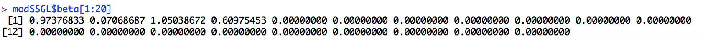
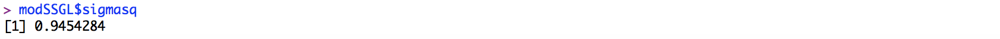
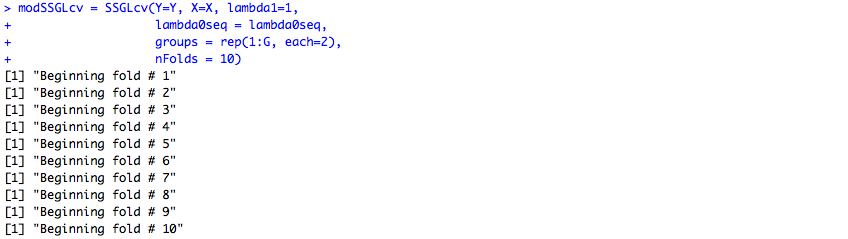
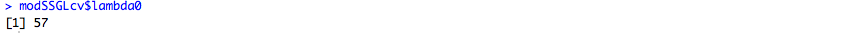
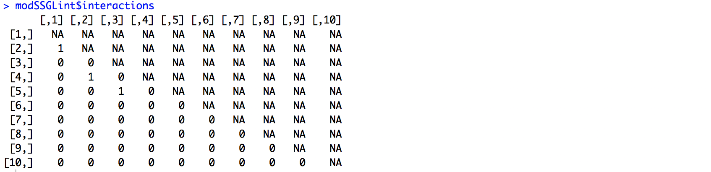

# SSGL
R package implementing the spike and slab group lasso

This is an R package to implement methods seen in "Spike-and-Slab Group Lassos for Grouped Regression and Sparse Generalized Additive Models" by Ray Bai, Gemma Moran, Joseph Antonelli, Yong Chen and Mary Boland, which can be found at the following link:

https://arxiv.org/pdf/1903.01979.pdf

To download the R package use the following in R:

```
library(devtools)
install_github(repo = "jantonelli111/SSGL")
library(SSGL)
```

There are four main functions in the package, which we will show how to use below. These functions and their corresponding purposes are as follows:

SSGLpath - The standard function for using the spike and slab group lasso with a chosen lambda0. This estimates the
           posterior mode for a ladder of lambda0 values that increase up until the chosen lambda0 value
           
SSGLcv - The function used to find the value of lambda0 to use  

SSGLspr - A function to use spike and slab group lasso for semiparametric regression using sparse additive linear models

SSGLint - A function to use spike and slab group lasso for nonlinear interaction detection  

# Using the SSGLpath and SSGLcv functions

Here, we will simulate a simple example to show how the software works. First we will show how the function works for a chosen value of lambda0

```{r, eval=FALSE}
n = 200
G = 100
x = mvtnorm::rmvnorm(n, sigma=diag(G))


X = matrix(NA, nrow=n, ncol=G*2)

for (g in 1 : G) {
  X[,2*(g-1) + 1] = x[,g]
  X[,2*g] = x[,g]^2
}

Y = 200 + x[,1] + x[,2] + 0.6*x[,2]^2 + rnorm(n, sd=1)

## Now fit model for chosen lambda0 and lambda1 values
modSSGL = SSGL(Y=Y, X=X, lambda1=.1, lambda0=10, 
groups = rep(1:G, each=2))

```

This will contain a list with estimates of the intercept, regression coefficients, residual variance, global sparsity parameter (theta), and the number of iterations it took to converge. Let's look at a couple of these now.

```{r, eval=FALSE}
## The first twenty regression coefficients
modSSGL$beta[1:20]
```


```{r, eval=FALSE}
## Estimate of the residual variance
modSSGL$sigmasq
```


```{r, eval=FALSE}
## Estimate of theta
modSSGL$theta
```


So we see that our model has correctly identified the first two covariates (represented in this example by first 4 covariates) as nonzero, while zeroing out the remaining coefficients. This example relied on a well-chosen value of lambda0, which we won't know in general. To solve this, one can use the cross-validation function as below:


```{r, eval=FALSE}
modSSGLcv = SSGLcv(Y=Y, X=X, lambda1=.1, lambda0seq = seq(4,20, by=2),
groups = rep(1:G, each=2), nFolds = 5)
```


Notice that you might see a warning message about the algorithm diverging. This tends to happen only for small lambda0 values, and is not a problem unless you see this warning for each lambda0 value in your sequence. In our experience, lambda0 sequences should go from around 1 to 25. Now one can check what the chosen value of lambda0 is:



And lastly run the model with the chosen lambda0 value:

```{r, eval=FALSE}
modSSGL = SSGL(Y=Y, X=X, lambda1=.1, lambda0=modSSGLcv$lambda0, 
               groups = rep(1:G, each=2))
```

# Using SSGLspr for sparse additive models

Now we will show how the SSGL procedure can be used to model sparse additive models. We will use roughly the same functions as seen in the manuscript of the paper. We will model the effect of each covariate using 2 degree of freedom splines. First, we simulate G covariates, and then we create new design matrices using natural splines.

```{r, eval=FALSE}
library(splines)

TrueF = function(x) {
  return(5*sin(pi*x[,1]) + 
           2.5*(x[,3]^2 - 0.5) + 1*exp(x[,4]) + 3*x[,5])
}

n = 200
G = 100

x = matrix(runif(G*n), nrow=n)
xnew = matrix(runif(G*n2), nrow=n2)
Y = TrueF(x) + rnorm(n, sd=1)
Ynew = TrueF(xnew) + rnorm(n2, sd=1)
```

And now we can build our SSGL model. Note that the modSSGLspr function already implements cross-validation, so nothing further is required.

```{r, eval=FALSE}
modSSGLspr = SSGLspr(Y=Y, x=x, xnew = xnew, lambda1=.1, DF=2)
```

And finally, we can plot the effect of exposure 1 and exposure 3 on the outcome. 

```{r, eval=FALSE}
par(mfrow=c(1,2), pty='s')
## Plot the effect of exposure 1 on the outcome
ord = order(x[,1])
Curve = modSSGLspr$fx[ord,1]
Truth = 5*sin(pi*x[ord,1])
plot(x[ord,1], Curve + mean(Truth) - mean(Curve), type='l', lwd=3,
     xlab="Covariate 1", ylab="f(X1)")
lines(x[ord,1], Truth, col=2, lwd=3)
legend("bottom", c("SSGL", "Truth"), lwd=3, lty=1, col=1:2)

## Plot the effect of exposure 3 on the outcome
ord = order(x[,3])
Curve = modSSGLspr$fx[ord,3]
Truth = 2.5*(x[ord,3]^2 - 0.5)
plot(x[ord,3], Curve + mean(Truth) - mean(Curve), type='l', lwd=3,
     xlab="Covariate 3", ylab="f(X3)")
lines(x[ord,3], Truth, col=2, lwd=3)
legend("topleft", c("SSGL", "Truth"), lwd=3, lty=1, col=1:2)
```


# Use in nonlinear interaction models

Here we will show how the SSGL procedure can be used to identify nonlinear interactions among a high-dimensional set of possible interactions. First we need to generate some data that includes interaction terms:

```{r, eval=FALSE}
TrueF = function(x) {
  return(2.5*(sin(pi*x[,1]*x[,2])) + 2*(cos(pi*(x[,3] + x[,5]))) +
           2*(x[,6] - 0.5) + 2.5*x[,7])
}

n = 300
G = 10

## generate data
x = matrix(runif(G*n), nrow=n)
Y = TrueF(x) + rnorm(n, sd=1)
```

And now we can use the SSGLint function to estimate the model with nonlinear interactions. Note that we can specify different numbers of degrees of freedom for the main effect functions and the interaction functions separately:

```{r, eval=FALSE}
modSSGLint = SSGLint(Y=Y, x=x, lambda1=.1, DFmain=2, DFint = 2)
```

And now we can look at which interaction terms are important

```{r, eval=FALSE}
modSSGLint$interactions

```



We see that there is an interaction term between covariate 1 and 2, as well as between covariate 3 and 5.
